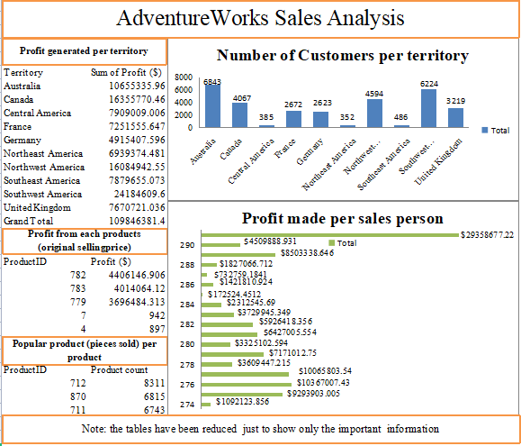

# AdventureWorks Sales Analysis
---

---
INTRODUCTION

The data used was retrieved from the AdventureWorks database, which includes many tables based primarily on data from the human resources department, production (manufacturing) department, purchasing department, contact management department, and sales department. AdventureWorks is a fictitious Washington-based company that manufactures bicycle components through Wide World Importers, based in Mexico City, and distributes both assembled bicycles and subcomponents to sales territories in North America, Europe, and Australia.

---
PROBLEM STATEMENT

The problem is to determine the following information from the data:
1. Which territory generates the most revenue?
2. What are the most profitable products among customers?
3. Which sales people generate the most profit?
4. What the reason for purchase among customers per territory where there are sale office?

---
SKILLS DEMONSTRATED

This project was completed using SQL and Excel.

---
DATA SOURCING

The data used was the AdventureWorks 2022 (OLTP version of about 200 MB) database, which was obtained from the Microsoft website. The database was downloaded and loaded into Microsoft SQL Server in order to have access to the different tables from various departments.

---
ANALYSIS

To address the above-stated problems, SQL queries were written to obtain data [Click to view queries](https://github.com/Somoye-D-Dataman/AdventureWorks-Sales-Analysis/blob/main/adventureworksSQLqueries.pdf) which were then saved and analyzed in Excel [1](https://github.com/Somoye-D-Dataman/AdventureWorks-Sales-Analysis/blob/main/Profit_per_territory.xlsx) [2](https://github.com/Somoye-D-Dataman/AdventureWorks-Sales-Analysis/blob/main/Profit_generated_from_each_product.xlsx) [3](https://github.com/Somoye-D-Dataman/AdventureWorks-Sales-Analysis/blob/main/Profit_made_per%20sales_person.xlsx) [4](https://github.com/Somoye-D-Dataman/AdventureWorks-Sales-Analysis/blob/main/Reason_for_sales_per_territory.xlsx) [5](https://github.com/Somoye-D-Dataman/AdventureWorks-Sales-Analysis/blob/main/Customer_number_per_territory.xlsx).

- The organization has sales representatives and offices across 10 territories around the world. According to the graph, Southwest America generated the most revenue, with $241,846,100. Canada was the second-most profitable territory, with $163,557,700 and Germany was the least profitable territory.
- The most profitable product is the Mountain-200 Black (size 38), which generated $440,614.70 in revenue. However, the most popular products are the AWC logo caps and water bottles, with 83,101 and 6,815 units sold, respectively. The LL Touring Frame-Blue 50 was the least sold product, with only 4 units sold.
- The most successful sales people are sales person ID 276 and sales person ID 277, who generated $293,586,770 and $103,670,070 in revenue, respectively. Sales person ID 285 generated the least profit, with only $172,524.50 in revenue.
- Customers in all territories were motivated to purchase products from AdventureWorks because of the affordable prices of the products compared to their competitors. Regular promotions were also a motivating factor, but magazine advertisements yielded no positive results.

---
CONCLUSION

AdventureWorks recorded a profit of $1,098,463,814 and Southwest America is currently the most successful territory.

---
RECOMMENDATION

AdventureWorks should increase its support for sales representatives in Germany in order to penetrate the largest European market. Marketing through magazine advertisements should be reduced or stopped, since it has no positive impact on product sales.
